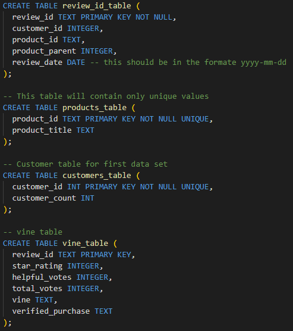
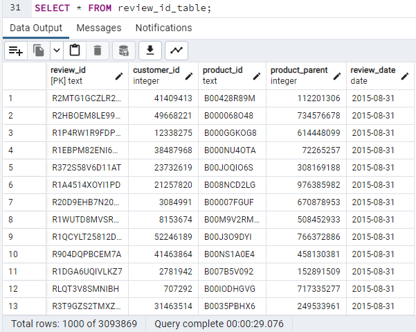
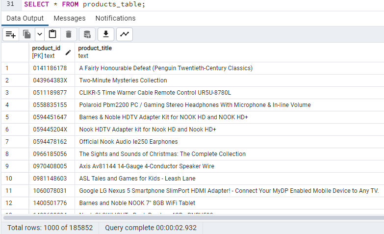
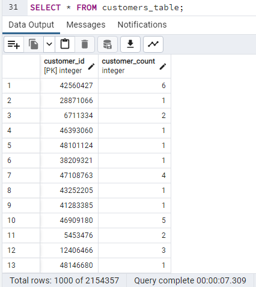
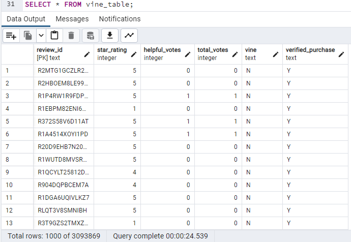
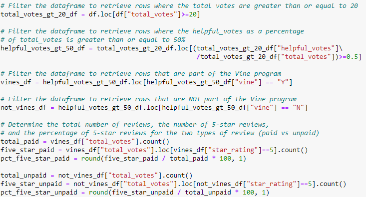
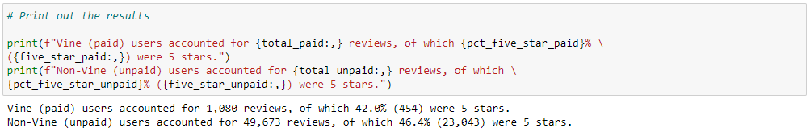

# BigMarket's Big Data with PySpark

## Overview of BigMarket
In the module, a startup called BigMarket helps businesses optimize their marketing efforts. One of their clients, $ellBy, is about to release a large catalog of products on Amazon and they want to know how their products compare to the reviews of similar products sold by their competitors. They are also considering joining the Vine program in which they send free products to reviewers in exchange for a guaranteed review. Natural language processing was used to parse the wording of reviews earlier in the module.

In this challenge assignment, we are looking at whether or not $ellBy should consider paying to participate in the Vine program. We picked an Amazon reviews dataset and use PySpark to perform the ETL process to extract the dataset, transform the data, connect to an AWS RDS instance, and load the transformed data into pgAdmin. Then, Pandas was used to determine if there is any bias toward favorable reviews from Vine members in the chosen dataset. The deliverables are as follows:

- **Deliverable 1: Perform ETL on Amazon Product Reviews**: Use the cloud ETL process to create an AWS RDS database with tables in pgAdmin, pick a dataset from the [Amazon Review datasets](https://s3.amazonaws.com/amazon-reviews-pds/tsv/index.txt), and extract the dataset into a DataFrame. Transform the DataFrame into four separate DataFrames that match the table schema in pgAdmin. Then, upload the transformed data into the appropriate tables and run queries in pgAdmin to confirm that the data has been uploaded.
- **Deliverable 2: Determine Bias of Vine Reviews**: Use Pandas to determine if there is any bias towards reviews that were written as part of the Vine program by determining if having a paid Vine review makes a difference in the percentage of 5-star reviews.

## Resources
- Data Source: [Amazon Electronics Reviews](https://s3.amazonaws.com/amazon-reviews-pds/tsv/amazon_reviews_us_Electronics_v1_00.tsv.gz)
- Language(s): PySpark, Python, SQL
- Application(s): Spark 3.2.3, pgAdmin4 6.15, Google Colab Notebooks, Amazon Web Services RDS, Jupyter Notebook
- PySpark Starter Script: [Amazon_Reviews_ETL_starter.ipynb](Amazon_Reviews_ETL_starter.ipynb)
- RDS Database SQL Schema: [challenge_schema.sql](challenge_schema.sql)
- Final PySpark Script: [Amazon_Reviews_ETL.ipynb](Amazon_Reviews_ETL.ipynb)
- Vine Review Python Script: [Vine_Review_Analysis.ipynb](Vine_Review_Analysis.ipynb)
- Exported vine_table: [vine_table.csv](data/vine_table.csv)

## Deliverable 1: Perform ETL on Amazon Product Reviews
The [Amazon reviews of "electronics"](https://s3.amazonaws.com/amazon-reviews-pds/tsv/amazon_reviews_us_Electronics_v1_00.tsv.gz) dataset was chosen.

DATA COLUMNS:
- marketplace: 2 letter country code of the marketplace where the review was written.
- customer_id: Random identifier that can be used to aggregate reviews written by a single author.
- review_id: The unique ID of the review.
- product_id: The unique Product ID the review pertains to.
- product_parent: Random identifier that can be used to aggregate reviews for the same product.
- product_title: Title of the product.
- product_category: Broad product category that can be used to group reviews (also used to group the dataset into coherent parts).
- star_rating: The 1-5 star rating of the review.
- helpful_votes: Number of helpful votes.
- total_votes: Number of total votes the review received.
- vine: Review was written as part of the Vine program.
- verified_purchase: The review is on a verified purchase.
- review_headline: The title of the review.
- review_body: The review text.
- review_date: The date the review was written.

The data was extracted into a DataFrame before being cleaned up separated into four separate DataFrames to match the schema for our database. These 4 DataFrames were then loaded into the database in pgAdmin which was connected to an AWS RDS instance. The script to perform these actions can be found here: [Amazon_Reviews_ETL.ipynb](Amazon_Reviews_ETL.ipynb)

SQL queries were used to verify that the data had been inserted into each table properly.

The vine_table was exported to a .csv file for use in the next Deliverable: [vine_table.csv](data/vine_table.csv)

## Deliverable 2: Determine Bias of Vine Reviews
After importing the [vine_table.csv](data/vine_table.csv) file into Python, the following calculations were performed to determine the percentages of Vine reviews that are 5 stars compared to the percentage of non-Vine reviews that are 5 stars. The script that performed these calculations can be found here: [Vine_Review_Analysis.ipynb](Vine_Review_Analysis.ipynb)

## Analysis

### Results
The results were printed out as follows:

From the image, we can see the following: 
- There  were 1,080 Vine reviews and 49,673 non-Vine reviews.
- There were 454 five-star Vine reviews and 23,043 five-star non-Vine Reviews.
- 42.0% of Vine reviews were five stars and 46.4% of non-Vine reviews were five stars.

### Summary
There was actually a lower percentage of five-star reviews for Vine users than for non-Vine users, so there does not appear to be a positivity bias for Vine users. In fact, the opposite appears to be true; it seems Vine users are less likely to leave a five-star review. This may be because Vine users give more thought and consideration to their reviews since they are receiving a free product and are almost doing this as a "job" of sorts. Vine users know more weight is given to their opinions, so they are probably less flippant with their reviews.

One additional analysis I would perform would be to load the dataset into R and perform statistical analyses, namely a two-sample t-test to determine if there is a statistically significant difference in the average rating between Vine and non-Vine users (using the population mean calculated from the combination of the two sample sets).